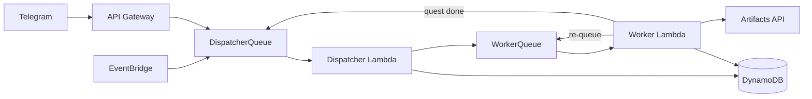

# At a glance

Welcome and thank you for your interest in this client to play [Artifacts](https://www.artifactsmmo.com/).

## Table of Contents

- [Architecture](#architecture)
- [Quick Start](#quick-start)
  - [Prerequisites Checklist](#prerequisites-checklist)
  - [Deployment Steps](#deployment-steps)
- [Local alternative for websocket (optional)](#local-alternative-for-websocket-optional)
- [Running cost](#running-cost)
- [Local execution](#local-execution)
- [Disclaimer](#disclaimer)
- [Todos and roadmap](#todos-and-roadmap)
- [Useful Cloud Watch Logs Insights queries](#useful-cloud-watch-logs-insights-queries)
  - [Get all non-info logs](#get-all-non-info-logs)
  - [Get logs](#get-logs)
  - [Get all logs of character](#get-all-logs-of-character)
  - [Get all logs of websocket container](#get-all-logs-of-websocket-container)
  - [Get all non-info logs (with log stream)](#get-all-non-info-logs-with-log-stream)
  - [Get all errors](#get-all-errors)
- [Local development with Powertools](#local-development-with-powertools)
- [Example Prometheus config](#example-prometheus-config)

## Support this project

If you find this project useful and want to support ongoing development, you can buy me a coffee on Ko-fi.

[](https://ko-fi.com/rbac3555)

# Architecture

This client utilizes a serverless architecture based on a variety of AWS services:



- AWS Lambda to process and apply the business logic of the client
- Amazon SQS to schedule process steps based on a character's cooldown
- Amazon DynamoDB to store current task list, bank reservations and statistics
- Amazon SNS to process the game's log events
- Amazon API Gateway to expose APIs for Telegram, webhook events and a metrics endpoint
- Amazon ECS to subscribe to websocket events (optional, requires Artifacts subscription)
- Amazon S3 to persist metrics
- Amazon CloudWatch to store this application's logs

# Quick Start

## Prerequisites Checklist

Before you begin, ensure you have the following installed and configured:

- [ ] [AWS account](https://aws.amazon.com/)
- [ ] [AWS CLI](https://docs.aws.amazon.com/cli/latest/userguide/install-cliv2.html) with an SSO profile configured
- [ ] [AWS SAM CLI](https://docs.aws.amazon.com/serverless-application-model/latest/developerguide/install-sam-cli.html)
- [ ] [Python 3.13](https://www.python.org/downloads/)
- [ ] [httpie](https://httpie.io/cli) (used by `deploy.sh` to download static game data)
- [ ] [jq](https://jqlang.github.io/jq/download/) (used by `deploy.sh` to format JSON files)
- [ ] An [Artifacts MMO](https://artifactsmmo.com/account/register) account with an API token
- [ ] A [Telegram bot](https://telegram.me/BotFather) for notifications and commands

Optional:

- [ ] [Artifacts subscription](https://docs.artifactsmmo.com/funding) for websocket events (recommended)
- [ ] Prometheus/Grafana stack to display metrics

## Deployment Steps

### Clone the repository

```bash
git clone <repository-url>
cd artifacts-mmo-sam
```

### Configure `samconfig.yml` parameter_overrides

Open `samconfig.yml` and set each parameter under `parameter_overrides`:

```yaml
parameter_overrides:
  - AccountName=<your-account-name>
  - PlayerToken=<your-artifacts-token>
  - CharacterNames=<Char1,Char2,...>
  - TelegramBotToken=<your-telegram-bot-token>
  - TelegramChatId=<your-chat-id>
  - NotifyItemDropCodes=<comma-separated-item-codes>
  - SubnetId=<subnet-id-from-default-vpc>
  - DlqAlertEmailRecipient=<your-email>
  - ApiBaseUrl=https://api.artifactsmmo.com
```

Details of the purpose and where to find each of the parameters can be found below:

- **AccountName**
  - Identifies your Artifacts account (used for API calls). Use your Artifacts account username.
- **PlayerToken**
  - Authenticates API requests to the Artifacts game server. Find it on your [Artifacts account page](https://artifactsmmo.com/account) under "Token".
- **CharacterNames**
  - Comma-separated list of character names the bot controls (up to 5). Use your in-game character names.
- **TelegramBotToken**
  - Authenticates the bot with the Telegram API for notifications. Create a bot via [@BotFather](https://telegram.me/BotFather) and copy the token.
- **TelegramChatId**
  - Target chat where the bot sends deployment and alert messages. Send a message to your bot, then call `https://api.telegram.org/bot<token>/getUpdates` to find your chat ID.
- **NotifyItemDropCodes**
  - Comma-separated list of item codes that trigger a Telegram notification when dropped during combat.
- **SubnetId**
  - Required only if deploying the optional ECS websocket container. This value comes from the **default VPC** of the AWS region you are deploying to. 
  - To find it: AWS Console → **VPC** → **Subnets** → filter by your deployment region → select any subnet belonging to the default VPC and copy its Subnet ID (e.g., `subnet-0abc1234def56789a`). Leave empty if you don't need the websocket container.
- **DlqAlertEmailRecipient**
  - Email address that receives alerts when messages land in the dead-letter queue. Use a monitored inbox.
- **ApiBaseUrl**
  - Base URL for the Artifacts game API. Use `https://api.artifactsmmo.com`.

### Configure `src/.env`

Copy or create `src/.env` with the following values:

```dotenv
PLAYER_TOKEN='<your-artifacts-token>'
ACCOUNT_NAME='<your-account-name>'
CHARACTER_NAMES='<Char1,Char2,...>'
TELEGRAM_BOT_TOKEN='<your-telegram-bot-token>'
TELEGRAM_CHAT_ID=<your-chat-id>
BASE_URL=https://api.artifactsmmo.com
PROFILE_NAME='<your-aws-sso-profile-name>'
```

Details of the purpose of each variable:

- **PLAYER_TOKEN**
  - Same as the `PlayerToken` parameter in samconfig.yml. Your Artifacts API token.
- **ACCOUNT_NAME**
  - Same as the `AccountName` parameter in samconfig.yml. Your Artifacts account username.
- **CHARACTER_NAMES**
  - Same as the `CharacterNames` parameter in samconfig.yml. Comma-separated list of character names.
- **TELEGRAM_BOT_TOKEN**
  - Same as the `TelegramBotToken` parameter in samconfig.yml. Your Telegram bot token.
- **TELEGRAM_CHAT_ID**
  - Same as the `TelegramChatId` parameter in samconfig.yml. Your Telegram chat ID.
- **BASE_URL**
  - Base URL for the Artifacts game API. Use `https://api.artifactsmmo.com`.
- **PROFILE_NAME**
  - The name of your AWS SSO profile as configured in `~/.aws/config`. Used by `deploy.sh` to authenticate with AWS.

### Configure game strategy (pre-deployment)

Before deploying, review and customize the files in `src/dispatcher-function/`. These files control the bot's behavior from the first dispatch cycle, so configure them before you deploy.

**Dispatch order:** The dispatcher is invoked every 10 minutes by EventBridge (or on-demand via Telegram). It short-circuits on the first successful dispatch:

1. `dispatch_events()` — active game events (resource/npc/monster spawns)
2. `dispatch_quest_leaders()` — leader characters run complex multi-step quests
3. `dispatch_quest_joiners()` — idle characters join a leader's unfinished gather-recipe tasks
4. `dispatch_single_quests()` — independent per-character tasks
5. `reset_failures()` — resets stranded characters

**Quest hierarchy:**

| Role | Source | Behavior |
|------|--------|----------|
| Leader | `QuestLeaderService._character_N()` | Complex quests; other characters may join |
| Joiner | Copy of leader's `gather-recipe` tasks | Supports the leader's active quest |
| Excluded | `get_quest_join_exclusions()` | Never joins leader quests |
| Single | `SingleQuestService._character_N()` | Independent tasks when no leader quest to join |

#### Configure `event_priorities.py`

Defines which characters participate in which game events. The list order determines priority when multiple events are active simultaneously.

```python
def event_priorities():
    return {
        character_1_name(): ['fish_merchant', 'strange_rocks', 'bandit_lizard'],
        character_2_name(): ['gemstone_merchant', 'magic_tree', 'bandit_lizard'],
        character_3_name(): ['herbal_merchant', 'magic_tree'],
        character_4_name(): ['nomadic_merchant', 'strange_rocks', 'magic_tree'],
        character_5_name(): ['timber_merchant', 'strange_rocks', 'magic_tree'],
    }
```

#### Configure `trade_limits.py`

Configures items your characters will buy from and sell to NPCs.

```python
def get_trade_limits() -> Dict[str, Dict[str, int]]:
    return {
        'golden_egg': {'max_quantity': 0},       # sell all
        'backpack': {'min_quantity': 1},         # buy up to 1
        'bandit_armor': {'max_quantity': 5},     # keep up to 5
    }
```

#### Configure `quest_leader_service.py`

Defines task lists for your main character(s) (quest leaders). Other characters will attempt to join the leader's quests.

```python
class QuestLeaderService(QuestService):
    def _character_1(self, character: CharacterSchemaExtension) -> List[Task]:
        return [
            Task.exchange_task_coins(),
            Task.claim_pending_items(),
            Task.level_skill(skill=CraftSkill.GEARCRAFTING, target_level=5),
            Task.ensure_equipment(exact_map={
                'copper_dagger': 3, 
                'copper_helmet': 3, 
                'copper_boots': 3,
                'copper_legs_armor': 3, 
                'copper_armor': 3,
            }),
            Task.solve_task(allow_cancellation=True),
            Task.fight_monster(monster='chicken', ttl=25),
            Task.fight_boss_monster(
                monster='king_slime',
                participants=[character_2_name(), character_3_name()],
                ttl=100,
            ),
        ]
```

#### Configure `single_quest_service.py`

Defines task lists for characters working independently (not joining a leader).

```python
class SingleQuestService(QuestService):
    def _character_2(self, character: CharacterSchemaExtension) -> List[Task]:
        return [
            Task.upgrade_basic_parts(skill=CraftSkill.MINING),
            Task.level_skill(GatheringSkill.MINING, 10),
            Task.solve_task(allow_cancellation=True),
        ]
```

#### Configure `quest_leaders.py`

Configures which characters are quest leaders, which are excluded from joining, and per-leader exclusion maps.

```python
# Characters whose quests others will join
def get_quest_leaders() -> List[str]:
    return [character_1_name()]

# Characters that never join any leader's quests
def get_quest_join_exclusions() -> List[str]:
    return [character_2_name()]

# Per-leader exclusion: prevent specific characters from joining a leader
def get_quest_join_exclusion_map() -> Dict[str, List[str]]:
    return {
        character_5_name(): [character_3_name(), character_4_name()],
    }
```

### Deploy

The deploy script reads the `PROFILE_NAME` from `src/.env` to determine which AWS SSO profile to use. Before running it, ensure your SSO session is active:

```bash
aws sso login --profile <your-aws-sso-profile-name>
```

Then deploy:

```bash
./deploy.sh
```

The script will: validate your AWS SSO session, download the latest static game data (maps, items, monsters, resources), build the SAM application, and deploy the CloudFormation stack. The deploy output will include the exact command needed for setting the Telegram webhook.

### Set Telegram webhook

After the first deployment, you need to point your Telegram bot to the deployed API Gateway endpoint. The deploy output includes the exact command — run it once:

```bash
http POST https://api.telegram.org/bot<TelegramBotToken>/setWebhook \
  url==https://<HttpApi-ID>.execute-api.<region>.amazonaws.com/prod/telegram -v
```

Replace `<TelegramBotToken>` with your bot token, `<HttpApi-ID>` with the HTTP API ID from the CloudFormation outputs, and `<region>` with your deployment region.

#### Verify

After setting the Telegram webhook, send `/status` to your bot. You should receive a summary of all characters and their current tasks.

> Note: On first deployment, the `🚀 New version deployed.` Telegram notification won't arrive since the webhook isn't set yet. On subsequent deployments it will.

If you have an Artifacts subscription and the ECS websocket container is deployed, the status response should also include a line like:

> `Connected to websocket server version: 7.0.4`

#### Telegram Commands

After deployment and webhook setup, you can interact with the bot via Telegram commands:

| Command | Description |
|---------|-------------|
| `/status` | Shows the current state of all characters including active tasks, cooldowns, and websocket connection status |
| `/dispatch` | Triggers an immediate dispatch cycle for all (or specified) characters, bypassing the EventBridge schedule |
| `/reset` | Resets specified characters by clearing their current quest and marking them available for new dispatch |
| `/restart` | Restarts specified characters by re-queuing their current task list from the beginning |
| `/bank` | Displays bank inventory, optionally filtered by item category (e.g., `/bank weapon`) |

Commands that accept parameters use character names separated by spaces.

### Prometheus (optional)

If you have a Prometheus/Grafana stack, configure it to scrape the metrics endpoint after first deployment:

1. Update `prometheus.yaml` with the REST API endpoint (see example config at the bottom of this README)
2. Reload the Prometheus configuration:

```bash
http POST <prometheus-server>:9090/-/reload
```

# Local alternative for websocket (optional)

Instead of running an ECS container to listen to websocket events and forward them to the API gateway endpoint, you can
deploy the prebuilt image on any other container orchestrator, for example Portainer, to save on
costs. You can find the image here: https://hub.docker.com/r/robachmann/artifactsmmo-websocket-container.
This container requires these environment variables to be set:

| Variable              | Description                                            | Mandatory | Default Value                     |
|-----------------------|--------------------------------------------------------|-----------|-----------------------------------|
| PLAYER_TOKEN          | Player's API Token                                     | Yes       | -                                 |
| WEBHOOK_URL           | Target endpoint to send received websocket message to  | Yes       | -                                 |
| SUBSCRIPTIONS         | Check `subscriptions.txt` for possible values.         | Yes       | -                                 |
| WEBSOCKET_URL         | Source endpoint to receive websocket messages from     | No        | `wss://realtime.artifactsmmo.com` |
| LOG_TEST_MESSAGES     | Flag to log received websocket messages of type `test` | No        | `false`                           |
| SKIP_SSL_VERIFICATION | Flag to skip SSL verification of websocket server      | No        | `false`                           |

# Running cost

Deploying this application will incur an average of 5-15 USD per month - depending on the selected region and deployed
parts.

# Local execution

Classes and files in `src/local-functions` are meant for local execution and will not be deployed. This way, code can be
safely tested. Most often, you will use it to find suitable combat configurations and plan your strategy.

# Disclaimer

This is a hobby project provided "as is", without warranty of any kind. The author(s) assume no responsibility or
liability for any misconfigurations, bugs, security issues, data loss, or costs incurred from deploying or using this
software, including but not limited to AWS charges. Use at your own risk.

# Todos and roadmap

There are currently no hot topics to address. Minor optimizations are implemented regularly.

# Useful CloudWatch Logs Insights queries

The following chapters contain examples of useful CloudWatch Logs Insights queries.

## Get all non-info logs

```
fields @timestamp, message_id, level, character_name, quest_id, task_id, kind, action, message
| filter @type not in ['START', 'REPORT', 'END']
| filter @message not like /INIT_START.+/
#| filter action not in ['fight', 'gather']
| filter level not in ['INFO']
#| filter character_name = ''
#| filter isempty(character_name)
| sort @timestamp desc
| limit 1000
```

## Get logs

```
fields @timestamp, message_id, level, character_name, quest_id, task_id, kind, action, message
| filter @type not in ['START', 'REPORT', 'END']
| filter @message not like /INIT_START.+/
#| filter action not in ['fight', 'gather']
#| filter level not in ['INFO']
#| filter character_name = ''
#| filter isempty(character_name)
| sort @timestamp desc
| limit 1000
```

## Get all logs of character

```
fields @timestamp, message_id, level, character_name, quest_id, task_id, kind, action, message
| filter @type not in ['START', 'REPORT', 'END']
| filter @message not like /INIT_START.+/
| filter action not in ['fight', 'equip', 'unequip', 'withdraw', 'deposit', 'rest', 'move', 'use-item']
#| filter level not in ['INFO']
| filter character_name not in ['<char_2>', '<char_3>', '<char_1>', '<char_4>']
#| filter character_name = ''
| filter not isempty(action)
| sort @timestamp desc
| limit 1000
```

## Get all logs of websocket container

```
fields @timestamp, @message
| sort @timestamp desc
| limit 1000
```

## Get all non-info logs (with log stream)

```
fields @timestamp, message_id, level, character_name, kind, action, message, @logStream
| filter @type not in ['START', 'REPORT', 'END']
| filter @message not like /INIT_START.+/
| filter level not in ['INFO']
#| filter character_name = ''
| sort @timestamp desc
| limit 1000
```

## Get all errors

```
fields @timestamp, @message, @logStream
| filter @type not in ['START', 'REPORT', 'END']
| filter @message not like /INIT_START.+/
| filter isempty(character_name)
| sort @timestamp desc
| limit 1000
```

# Local development with Powertools

`pip install "aws-lambda-powertools[aws-sdk]"`

# Example Prometheus config

```
- job_name: 'artifacts-mmo'
  scheme: https
  metrics_path: '/prod/metrics/metrics.prom'
  scrape_interval: '5m'
  static_configs:
    - targets: ['<resource-name>.execute-api.<region>.amazonaws.com']
```
